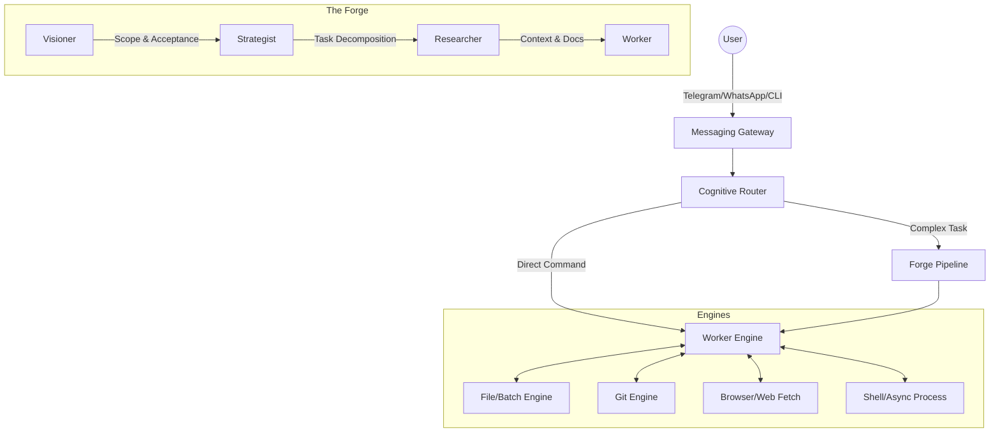

<div align="center">

<pre>
                  .-'-.                    
                 /     \                   
               _/       \_                 
              / |       | \                
             /  |  __   |  \               
            /   | (  )  |   \              
           /    |  ||   |    \             
          /     |  ||   |     \            
         /______|__||___|______\           
                   ||               * .  * 
                   ||     _______  .  * .  
                   ||    [=======]   *  .  
                   ||    |       | .  *  . 
                   ||    |_______|   *  .  
                   ||    |       |         
               ____||____|_______|____     
              [_______________________]    
              |                       |    
              |                       |    
              |_______________________|    

      F  O  R  E  M  A  N   |   T  H  E   F  O  R  G  E
</pre>

### AI Agent Orchestrator — Atomic Thought Chains with Vision, Research, and Tactical Reasoning

[](https://github.com/sovranamr/foreman)
[](https://github.com/sovranamr/foreman)
[](https://github.com/sovranamr/foreman)
[](https://github.com/sovranamr/foreman)

> *"Do not simply write code. Forge it. Strike the iron while it's hot, temper it with research, and shape it with strategy."*

</div>

---

## 📖 For Everyone: What is Foreman?

Imagine having a **Senior Staff Engineer** living directly inside your Telegram, WhatsApp, or Terminal. 

Foreman is not just a chatbot that answers questions. It is a **fully autonomous coding agent** that can:
- **Read and write files** on your machine.
- **Run terminal commands** to build, test, and deploy software.
- **Browse the web** to read documentation or search for solutions.
- **Plan and execute** entirely new features from scratch.

If you ask it to *"Build a weather app,"* Foreman will design the UI, figure out the API, write the frontend, setup the backend, run tests to ensure it works, and fix any errors it encounters—all while sending you progress updates via text messages. 

It thinks, it researches, it builds, and it verifies. 

---

## ⚙️ For Developers: The Technical Reality

Foreman is a **multi-agent orchestrated execution environment**. It bridges the gap between Large Language Models (LLMs) and local machine state through a heavily constrained, securely isolated Execution Engine. 

Built on a zero-dependency local ethos (with robust API integrations), Foreman utilizes a revolutionary architectural pattern known as the **Forge Pipeline**. Instead of relying on a single zero-shot LLM pass, complex tasks are routed through a 4-layer cognitive pipeline. 

### 🧠 The Cognitive Router
Every incoming request (from CLI, Telegram, or WhatsApp) hits the `Cognitive Router`. This engine determines the cognitive load of the prompt. 
- **Direct Mode:** For simple tasks (`"What does this file do?"` or `"Run git status"`), the request is passed directly to the Worker layer for immediate execution.
- **Forge Mode:** For complex tasks (`"Refactor the authentication module"`, `"Build a new dashboard"`), the router triggers the full **Forge Pipeline**.

---

## ⚒️ The Forge Pipeline (4-Layer Orchestration)

When a complex task is triggered, Foreman spins up a micro-team of specialized sub-agents. They operate in a strict sequence, passing context downward.



### 1️⃣ The Visioner (`src/vision-pipeline.ts`)
**The Architect.** Analyzes the raw user prompt and defines the *True North*. It outputs a strict set of Acceptance Criteria and a Vision Document. It does not write code; it defines what "done" looks like.

### 2️⃣ The Strategist (`src/thought-manager.ts`)
**The Project Manager.** Takes the Vision Document and breaks it down into atomic, highly tactical steps. It sequences dependencies (e.g., *"We must initialize the package.json before writing the entry point"*).

### 3️⃣ The Researcher (`src/research-engine.ts`)
**The Scout.** Takes the strategy and executes localized and web searches. It reads existing project files, greps the codebase, pulls the latest API docs via web fetch, and builds a massive Context Payload. 

### 4️⃣ The Worker (`src/worker-executor.ts`)
**The Blacksmith.** Takes the explicit instructions and the researched context and begins striking the anvil. It has full access to the Execution Engine. It writes code, runs `npm install`, runs tests, and reads the output. If a test fails, the Worker enters a self-healing loop until the Acceptance Criteria (defined by the Visioner) are met.

---

## 🛠️ The Engines

Foreman is powered by a suite of specialized, highly-tested typescript engines.

| Engine | Capability | Description |
| :--- | :--- | :--- |
| **Execution Engine** | `src/execution-engine.ts` | The core sandbox. Safely executes bash commands with SIGKILL timeouts, line-range file reading, and middle-cut truncation to protect LLM context limits. |
| **Git Engine** | `src/git-engine.ts` | Deep Git integration. Analyzes diffs, checks statuses, manages commits, and handles automatic rollbacks if the pipeline fails. |
| **Security Scanner**| `src/security-scanner.ts` | Enforces safety. Prevents destructive commands (`rm -rf /`, fork bombs) and blocks SSRF attempts in web fetching. |
| **Context Intel** | `src/context-intelligence.ts`| Semantic analysis and Markdown intelligence. Parses complex documentation and extracts only the code fences or tables needed by the Worker. |
| **Messaging Gateway**| `src/messaging-gateway.ts`| Connects the orchestrator directly to `@whiskeysockets/baileys` (WhatsApp) and `grammy` (Telegram) for real-time remote control. |

---

## 🚀 Capabilities

- **Multi-Session Sub-agents:** Foreman can spawn isolated sub-agents to handle parallel background tasks (`src/subagent-engine.ts`).
- **Interactive Approval:** Automatically pauses and asks the human for permission via Telegram before executing highly destructive commands.
- **Visual QA:** Capable of spinning up an internal browser (`src/browser-engine.ts`), taking screenshots, and visually validating UI work using image comparison tools like `pixelmatch`.
- **Memory Persistence:** Uses persistent memory bridges (`src/memory-md-bridge.ts`) to remember your coding preferences, API keys, and architectural decisions across sessions.

---

## 💻 Getting Started

### Installation
Clone the repository and install dependencies:

```bash
git clone https://github.com/sovranamr/foreman.git
cd foreman
npm install
```

### Running Foreman

Start the interactive CLI Repl:
```bash
npm run build
./bin/foreman
```

Start the Messaging Gateway (Telegram/WhatsApp):
```bash
./bin/foreman --gateway
```

### Usage Examples

**In CLI:**
```bash
> Foreman, grep the src directory for 'TODO' and fix the ones in orchestrator.ts
> Run the tests, and if they fail, keep fixing the engine until they pass.
```

**In Telegram (`/forge` command):**
```text
/forge Build a dark-mode toggle component in React. Read the existing Tailwind config to ensure colors match our current theme. Write the tests and verify them in the browser.
```

---

## 🛡️ Security & Constraints

Foreman has root-level access to the directory it is started in. **With great power comes great responsibility.**
- **Dangerous Commands Blocked:** `src/enforce.ts` strictly prohibits harmful bash commands.
- **Rollback Engine:** Failed Forge pipelines automatically revert Git trees to their previous state to prevent broken commits.
- **Cost Tracking:** The `CostTracker` monitors token usage and halts the pipeline if anomalous spending is detected.

---
<div align="center">
  <p><i>Forged with ⚙️ by the Open Source Community.</i></p>
</div>
